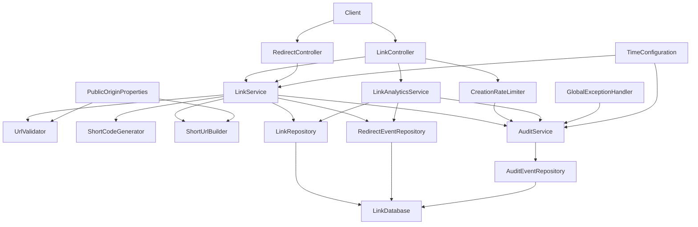
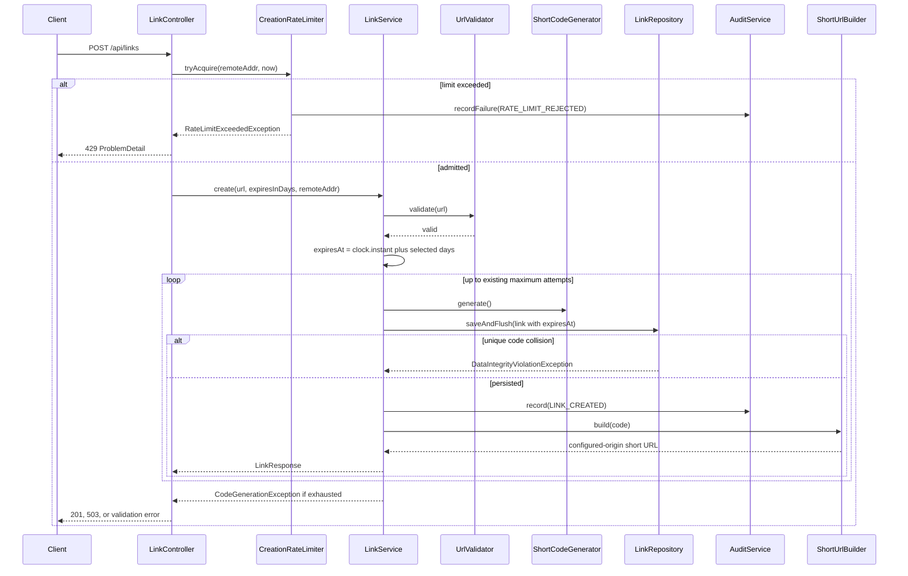
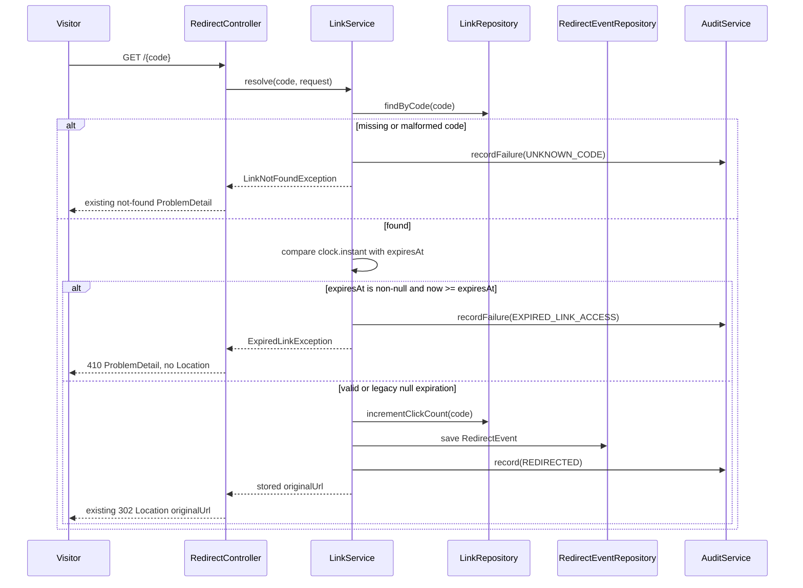

# Short-link safety and reliability design

## Scope and compatibility

This is a brownfield change to the existing single Spring Boot service in package `com.example.shortener`. The existing controller-to-service-to-repository layering, JPA entities, audit repository, short-code generator, analytics behavior, error handling, and HTTP 503 code-exhaustion behavior remain intact.

The change adds:

- Validated configured public-origin handling.
- Canonical self-origin host comparison.
- Per-instance, atomic, rolling one-minute creation limiting.
- Default and requested link expiration.
- HTTP 410 handling for expired links.
- Audit and application logging for rate-limit rejections and expired-link accesses.

Existing links with a null `expiresAt` remain non-expiring. Existing successful redirects, missing-link responses, analytics semantics, and code-generation exhaustion behavior are preserved.

## Configuration

`app.public-origin` is the primary property. The existing server configuration may provide the documented fallback origin when `app.public-origin` is not explicitly supplied, but the resolved value must be a valid absolute HTTP or HTTPS origin. There is never a request-Host fallback.

Example configuration:

```yaml
app:
  public-origin: ${APP_PUBLIC_ORIGIN:http://localhost:${server.port:8080}}
  time-zone: ${APP_TIME_ZONE:UTC}
  expiration-default-days: 90
  creation-rate-limit: 30
  creation-rate-window: 1m
server:
  port: 8080
```

`PublicOriginProperties` binds the resolved origin and validates it during application context creation. Validation requires an absolute HTTP or HTTPS URI with a host, permits an optional non-root path prefix, and rejects user information, fragments, and invalid authority data. A missing or invalid effective origin fails startup or configuration binding. The origin is normalized by removing trailing path slashes while preserving scheme, explicit port, and path prefix.

`TimeConfiguration` exposes an injectable `java.time.Clock`, defaulting to UTC system time. Tests can replace it with a fixed clock. Expiration calculations and audit timestamps use this clock.

The binding decision explicitly accepts that rate limiting is per application instance and uses only `HttpServletRequest.getRemoteAddr()`; forwarding headers are ignored.

## Components and responsibilities



### Controllers

`LinkController` validates JSON at the boundary with Jakarta Bean Validation and obtains the connection client IP from `getRemoteAddr()`. It invokes the rate limiter before URL validation, code generation, and persistence. A request rejected by the limiter cannot consume a generator attempt or create a link.

`RedirectController` delegates resolution and returns the stored validated destination in the `Location` header for a valid link. It does not construct the destination from the request host. The configured public origin is used only by `ShortUrlBuilder` for generated short URLs and any existing contract requiring a generated short URL.

`GlobalExceptionHandler` retains RFC 7807 `ProblemDetail` responses used by the current service and adds mappings for rate-limit and expiration exceptions. Existing clients continue to receive the established error shape and fields.

### Services

- `CreationRateLimiter`: atomic in-memory rolling-window admission control, scoped to one JVM instance.
- `LinkService`: validates, calculates expiration, generates and persists links, resolves redirects, checks expiration before click accounting, and writes audit records.
- `UrlValidator`: validates absolute HTTP/HTTPS targets and rejects self-origin redirect paths after canonical host comparison.
- `ShortUrlBuilder`: builds URLs exclusively from the validated configured origin and configured path prefix.
- `AuditService`: writes audit records using the injected clock and supports independent failure/rejection transactions.
- `LinkAnalyticsService`: unchanged except for constructor/configuration test updates.

### Repositories and persistence

`LinkRepository` remains responsible for links and atomic click-count updates. `RedirectEventRepository` remains responsible for analytics events. `AuditEventRepository` is reused for new operational events; no separate rate-limit store or audit table is introduced.

## Request flows

### Creation flow



Admission occurs before URL validation by design, as required by the implementation plan. Every admitted creation request follows existing validation and generation behavior. A rate-limited request performs no validation-dependent generation or persistence work.

### Redirect flow



The expiration check occurs before click-count increment and redirect-event persistence. At exactly `expiresAt`, the link is expired. A null `expiresAt` means never expires for backward compatibility.

## Public-origin URL construction

`ShortUrlBuilder` receives `PublicOriginProperties` through constructor injection. It never reads `HttpServletRequest.getScheme()`, `getServerName()`, `getServerPort()`, or the Host header. It joins the normalized configured origin and optional path prefix with the seven-character code.

For example, configured origin `https://public.example/short` and code `Abc1234` produce `https://public.example/short/Abc1234`, regardless of the request Host header.

Redirect `Location` remains the stored validated target URL, preserving existing redirect behavior. No request-derived public URL is emitted.

## Canonical self-origin validation

`UrlValidator` parses both the destination and configured origin. Scheme comparison remains case-insensitive and explicit/effective port comparison is preserved. Host comparison uses one centralized function:

1. Obtain the parsed host.
2. Remove one or more trailing DNS dots.
3. Convert with `java.net.IDN.toASCII` using the platform's consistent IDN behavior.
4. Apply case folding using `Locale.ROOT`.
5. Compare the resulting ASCII host strings.

A destination is self-origin when canonical scheme, canonical host, and effective port match. Existing path behavior is preserved: the configured origin itself, its trailing slash form, and its generated seven-character redirect paths are rejected as self-links; unrelated paths on the same origin retain the existing validation behavior.

No private-network, malware, reputation, or content scanning is added.

## Rate limiting algorithm

`CreationRateLimiter` stores `ConcurrentHashMap<String, ClientWindow>`, keyed by the direct remote address. Each `ClientWindow` contains a deque of admission timestamps and a lock. `tryAcquire` executes under that per-client lock:

1. Read the injected clock.
2. Remove timestamps older than the one-minute rolling boundary.
3. If the deque has 30 entries, reject without adding a timestamp.
4. Otherwise append the current timestamp and admit.

The operation is atomic for one IP, so concurrent requests cannot materially exceed 30 admissions in a rolling minute. Periodic opportunistic cleanup removes entries whose deque is empty and whose last activity is older than the window. Cleanup is performed without holding a global lock and may leave harmless short-lived empty entries.

The limiter is per JVM instance. It is not a distributed quota and does not use H2 persistence. Distinct remote addresses have independent windows. `X-Forwarded-For` and similar headers are ignored, even if present.

Rate-limit audit recording uses action `RATE_LIMIT_REJECTED`, a privacy-preserving client identifier, event timestamp, and outcome. The current audit schema already has a `client_ip` field; the implementation stores the remote address as the existing operational identifier, with optional masking/truncation policy centralized in `AuditService`. Logs do not include URLs.

## Expiration model and algorithm

The request record adds nullable `Integer expiresInDays`. Bean validation permits null or values from 1 through 365. Jackson deserialization and the global handler convert non-integer, malformed, or syntactically invalid values into the established 400 `ProblemDetail` response.

For a new link:

- Null `expiresInDays` selects the configured default of 90 days.
- A supplied value selects that many days.
- `expiresAt = clock.instant().plus(durationDays, ChronoUnit.DAYS)`.

The same captured creation instant is used for `createdAt` and expiration calculation. `expiresAt` is persisted as `Instant` in a nullable `links.expires_at` column.

`LinkResponse` adds nullable `expiresAt` without removing existing fields. Details responses expose the field for new links and omit/null it for legacy links.

At resolution, `expiresAt != null && !now.isBefore(expiresAt)` means expired. Expired access returns 410, produces no Location header, increments no clicks, and creates no redirect analytics event.

## Persisted data model

```mermaid
erDiagram
    LINKS ||--o{ REDIRECT_EVENTS : receives
    LINKS {
        bigint id PK
        varchar code UK
        varchar original_url
        bigint click_count
        timestamp created_at
        timestamp expires_at nullable
    }
    REDIRECT_EVENTS {
        bigint id PK
        bigint link_id FK
        timestamp event_time
        date event_day
        varchar referrer nullable
    }
    AUDIT_EVENTS {
        bigint id PK
        timestamp event_time
        varchar action
        varchar code nullable
        varchar client_ip
        varchar outcome
    }
```

`expires_at` is nullable to preserve pre-change links. Existing Hibernate update behavior can add the nullable column in the current H2 deployment; production schema rollout must add it before deploying code that reads or writes it.

Audit actions include at least:

- `RATE_LIMIT_REJECTED`: code null, client identifier, timestamp, outcome such as `LIMIT_EXCEEDED`.
- `EXPIRED_LINK_ACCESS`: short code, client identifier when available, timestamp, outcome such as `GONE`.
- Existing actions such as `LINK_CREATED`, `REDIRECTED`, `UNKNOWN_CODE`, and `CREATION_REJECTED` remain unchanged.

Audit fields never contain the full destination URL, credentials, API keys, passwords, or unnecessary personal data.

## Transactions, concurrency, and reliability

- Creation persistence and successful `LINK_CREATED` audit occur in the existing new transaction so they commit together.
- Rate-limit and expired-access audits use `REQUIRES_NEW`, allowing the audit to survive request-path failures. If audit persistence itself fails, the failure is logged with action and exception type; the intended 429 or 410 response is retained rather than being replaced by an audit database error.
- Code-generation collision handling remains the existing bounded retry loop and database uniqueness constraint. The rate limiter runs before the loop, so rejected requests do not consume generator attempts.
- Redirect expiration is checked before click increment. The existing atomic increment remains the concurrency guard for clicks; a concurrent expiration boundary may be resolved according to the captured service clock at the point of the check.
- The in-memory limiter is thread-safe within one service instance but cannot enforce an aggregate limit across instances. This accepted deployment limitation is documented rather than hidden.
- H2 remains the only database and no external infrastructure is introduced.
- Constructor injection is used throughout. New configuration and clock components are Spring beans and are replaceable in unit and HTTP tests.

## Error handling

| Condition | Status | Response |
|---|---:|---|
| Missing/blank URL, malformed URL, invalid expiration, malformed JSON | 400 | Existing RFC 7807 `ProblemDetail` format |
| Self-origin destination | 400 | Existing invalid-URL `ProblemDetail` |
| Requests 31+ in the rolling minute for one remote IP | 429 | Standard rate-limit `ProblemDetail` |
| Code generation exhausted | 503 | Existing code-generation `ProblemDetail` |
| Missing short code | Existing status | Existing not-found `ProblemDetail` |
| Expired link | 410 | Expiration `ProblemDetail`, no Location header |
| Valid link | Existing status | Existing redirect and destination behavior |

## Logging

- `INFO`: successful link creation with short code and outcome; successful redirect with short code and outcome; analytics requests.
- `WARN`: rate-limit rejection with action, bounded client identifier, timestamp, and outcome; expired-link access with short code, timestamp, and outcome; invalid URL, missing link, and code-collision retry.
- `ERROR`: code-generation exhaustion, unexpected failures, and audit persistence failures. Include exception type and operational identifiers only.

Logs are structured as key-value fields where supported. They do not include full original URLs, query strings, request bodies, Host headers, authorization data, credentials, API keys, passwords, or full personal data. Short codes are acceptable operational identifiers; client IP handling follows the audit privacy policy and is not copied into unrelated logs.

## Alternatives rejected

- Request Host-based URL construction was rejected because it permits host-header poisoning and makes public links deployment-dependent.
- A fixed-window limiter was rejected because it permits boundary bursts inconsistent with the required rolling one-minute window.
- A token bucket was rejected because the requirement specifies a count of 30 requests in a rolling window and the deque algorithm directly models that rule.
- A distributed limiter was rejected because no external infrastructure is allowed and the human binding explicitly accepts per-instance limiting.
- Persisting rate-limit counters was rejected because the accepted design is in-memory per instance and counters are operational state rather than application data.
- Treating legacy null expiration as expired was rejected because it would break links created before this change.
- Redirecting expired links or returning 404 was rejected because clients must distinguish intentional expiration with HTTP 410.
- Malicious-URL and private-network scanning was rejected as explicitly out of scope.
