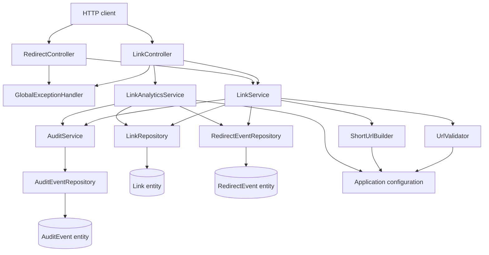
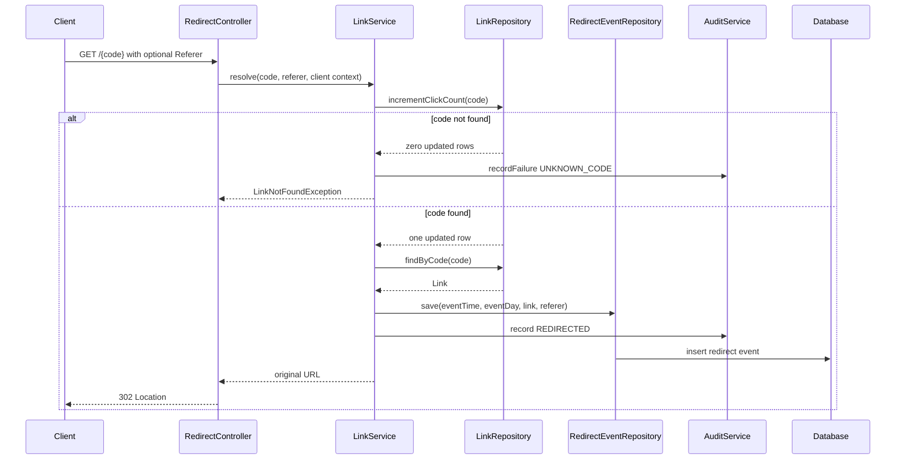
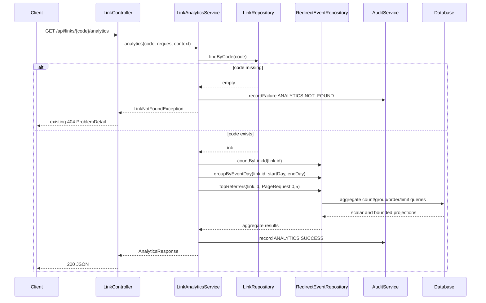
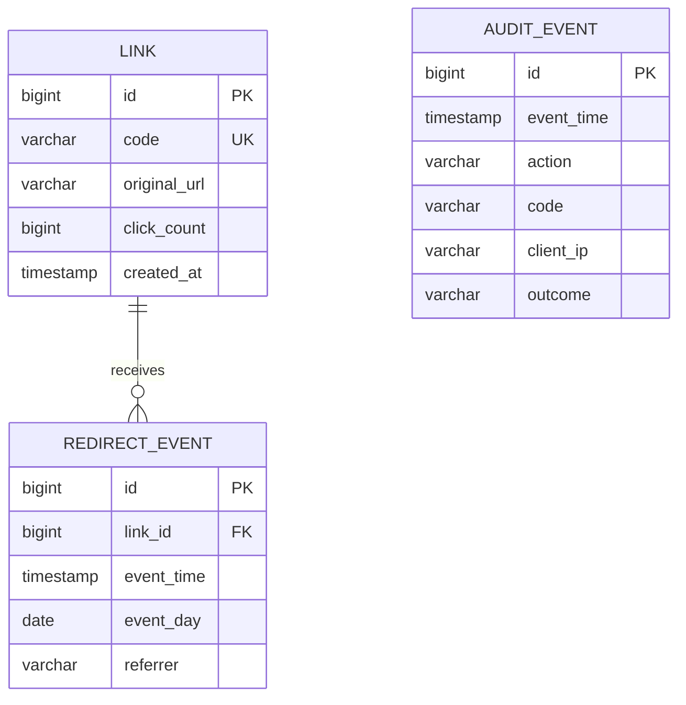

# URL Shortener Analytics and Validation Design

## Scope and brownfield compatibility

This is an additive brownfield change to the existing Spring Boot service. Existing create-link, link-details, redirect, not-found, invalid-URL, click-count, status-code, header, and response-body contracts remain unchanged. The new analytics endpoint and redirect-event table are additive. Existing redirect events are not backfilled.

The implementation remains within the existing controller -> service -> repository layering and uses constructor injection, `jakarta.*` APIs, Spring Data JPA, H2, and the existing audit service. No external infrastructure or new dependency is required.

## Components and responsibilities



### Controllers

* `LinkController` retains the existing POST `/api/links` and GET `/api/links/{code}` operations and adds GET `/api/links/{code}/analytics`.
* `RedirectController` retains the existing 302 redirect response and passes the request's `Referer` header to the service.
* `GlobalExceptionHandler` continues returning `ProblemDetail`. It classifies new validation failures for audit and logging without changing their client-facing invalid-URL response.

### Services

* `LinkService` validates destinations before persistence, creates links using the existing collision retry behavior, atomically increments the existing click counter, and persists one redirect event for every successful redirect.
* `LinkAnalyticsService` resolves the link, calculates the configured 30-calendar-day window, executes scalar and grouped repository queries, fills missing days with zeroes, and records analytics audit outcomes.
* `UrlValidator` validates absolute HTTP(S) URLs, rejects URLs longer than 2048 characters, and rejects URLs in the configured shortener origin and redirect path space.
* `ShortUrlBuilder` uses the configured public origin or a server-side configured fallback. It never reads the incoming Host header.
* `AuditService` reuses the existing audit table and transaction semantics.

## Request flows

### Link creation and validation

1. The controller applies Bean Validation to the existing request body.
2. `LinkService` calls `UrlValidator` before opening the creation transaction.
3. `UrlValidator` rejects null, blank, malformed, unsupported, over-long, or self-referential URLs with `InvalidUrlException`.
4. Self-link and length failures are logged with a reason and audited using `recordFailure`, without storing the destination or link.
5. Valid links use the existing short-code generation and collision retry loop. The existing successful response is unchanged.

The maximum is based on Java character length, matching the existing entity column and requirement wording. The public origin is parsed structurally. Scheme and host are case-normalized, default ports are normalized away, and explicit non-default ports must match. A destination is self-referential only when its normalized origin equals the configured origin and its path is the shortener's redirect URL space (the root or a path beginning with `/` followed by a valid seven-character code). Query and fragment components do not make an otherwise self-origin URL safe.

Configuration precedence:

1. `app.public-origin`, when nonblank.
2. A server-side fallback formed from `app.fallback-scheme`, `app.fallback-host`, `server.port`, and optional `app.fallback-context-path`.

The fallback host is configuration, not request data. The service must fail startup or fail configuration validation if neither a usable public origin nor a usable fallback is configured. `server.address` may be used only if explicitly configured as a public host; an incoming `Host` header is never used.

### Redirect and event persistence



`resolve` is transactional. The atomic existing `incrementClickCount` update remains the concurrency-safe click-counter operation. The event insert and existing redirect audit are in the same transaction as the counter update. If event persistence fails, the transaction rolls back and the redirect does not return a successful 302, preventing a successful redirect without its required event. Exactly one event save is performed after a successful counter update.

The event stores:

* `eventTime`: `Instant`, persisted consistently as a timestamp.
* `eventDay`: server-timezone `LocalDate`, calculated from `eventTime` using the configured `app.time-zone`. This makes database grouping deterministic across H2 and production databases, including daylight-saving boundaries.
* `referrer`: nullable, containing the `Referer` header exactly as received when nonblank; absent or blank headers are stored as null.
* `link_id`: foreign key to the link.

### Analytics request

1. The controller logs the operation and delegates to `LinkAnalyticsService`.
2. The service validates the code format and loads the link using the existing not-found behavior.
3. For an existing link, it executes three database-backed queries:
   * `countByLinkId` for total clicks.
   * A date-bounded `GROUP BY eventDay` query for the current day and preceding 29 days.
   * A nonblank-referrer `GROUP BY referrer ORDER BY count DESC, referrer ASC` query with a `PageRequest` of five rows, causing the database query to include a limit.
4. The service creates exactly 30 date buckets from the bounded grouped result, inserting zero counts for absent days.
5. Success, not-found, and processing-error outcomes are audited. The endpoint response is returned without loading individual redirect events.



## Persisted data model



Add an index on `redirect_events(link_id, event_day)` and an index on `redirect_events(link_id, referrer)` as appropriate for H2 and the configured schema strategy. `Link` keeps its current fields and click-count semantics; the relationship may be represented by the foreign key on `RedirectEvent` without an eager collection on `Link`, avoiding accidental event loading.

`AuditEvent` remains compatible with its current columns. New action values fit the existing length: `ANALYTICS_REQUEST` and `CREATION_REJECTED`. Outcomes include `SUCCESS`, `NOT_FOUND`, `SELF_LINK`, `URL_TOO_LONG`, and `ERROR`, with safe bounded context only.

## Analytics response and query algorithms

The response shape is:

```json
{
  "totalClicks": 12,
  "clicksPerDay": [
    {"date": "2026-09-02", "count": 0},
    {"date": "2026-09-03", "count": 2}
  ],
  "topReferrers": [
    {"referrer": "https://example.org", "count": 5}
  ]
}
```

`clicksPerDay` always has exactly 30 entries, ordered oldest to newest, covering the current configured-timezone calendar day and 29 preceding calendar days. The database daily query uses `eventDay >= startDay` and `eventDay <= currentDay`; the service fills any missing dates with zero. The equivalent instant window is inclusive at the start of the start day and exclusive at the start of the following day.

Recommended projections are interfaces or records containing only `eventDay`, `count`, `referrer`, and `count`. The repository must not expose `findAllByLink...` for analytics. The top-referrer repository method accepts `Pageable`; the service passes `PageRequest.of(0, 5, Sort.by(descending count, ascending referrer))`, or an equivalent explicit grouped query with database-side limit. Null, empty, and whitespace-only referrers are excluded in SQL. Ties are deterministic by ascending referrer.

A `Clock` bean configured for the server timezone should be injected into the analytics and redirect services rather than calling `Instant.now()` directly everywhere. Existing audit timestamps may continue using `Instant.now()` unless the current audit design is standardized on the same clock.

## Origin and URL validation

`UrlValidator` first rejects values over 2048 characters with the existing detail `url must be an absolute HTTP or HTTPS URL`. It then parses the URI and applies the existing absolute HTTP/HTTPS checks. It compares the target origin with the configured origin using:

* lowercase scheme;
* lowercase DNS host, with IPv6 normalized by URI parsing;
* effective port, where HTTP 80 and HTTPS 443 are treated as default and equivalent only to their omitted form;
* no comparison based on DNS resolution, aliases, or the request Host header.

A same-origin URL is rejected only when it targets the shortener redirect URL space. Same-origin URLs outside that space remain valid according to the existing URL rules. The rejection exception carries an internal safe reason such as `SELF_LINK` or `URL_TOO_LONG`, while its public message remains the existing invalid-URL message.

`ShortUrlBuilder` uses the same normalized configured origin and appends the code. It no longer derives a public base URL from `HttpServletRequest`.

## Logging and audit trail

Logging must never include credentials, authorization headers, full personal data, full destination URLs, full referrers, or request bodies.

* `INFO`: successful link creation, successful redirect, and analytics success. Include operation, bounded code, and outcome.
* `INFO`: every analytics request may be logged at request start or completion with operation, bounded code, and outcome. The timestamp is supplied by the logging framework and audit event.
* `WARN`: self-link rejection, over-long URL rejection, invalid code/not-found, and ordinary invalid requests. Include rejection reason and outcome, but not the destination.
* `ERROR`: event persistence failure, audit persistence failure, unexpected exceptions, or exhausted code-generation retries. Include exception type and operation, not secrets or request contents.

Audit records:

* `REDIRECTED`: existing action, code, client IP according to the existing model, timestamp, and `REDIRECTED` outcome; written with the redirect transaction.
* `ANALYTICS_REQUEST`: code, client IP according to the existing model, timestamp, and `SUCCESS`, `NOT_FOUND`, or `ERROR` outcome. Failure outcomes use `REQUIRES_NEW` so they survive request rollback.
* `CREATION_REJECTED`: no code, client IP according to the existing model, timestamp, and `SELF_LINK` or `URL_TOO_LONG` outcome. Existing invalid-request auditing remains unchanged.

The audit trail records no raw destination URL or referrer. If the existing audit implementation requires a reason, use the safe reason in the outcome field, bounded to the existing column size.

## Error handling and reliability

* New self-link and over-length failures use the existing HTTP 400 invalid-URL `ProblemDetail`, title, status, and detail.
* Analytics for an unknown code uses the existing HTTP 404 `ProblemDetail` and `LinkNotFoundException` behavior.
* Invalid analytics code format follows the existing not-found behavior and is audited as `ANALYTICS_REQUEST` with `NOT_FOUND`.
* Analytics query failures return the existing generic 500 response after logging and auditing an error outcome.
* Validation occurs before link persistence, so rejected URLs cannot create rows.
* Redirect event insertion is not best-effort; failure rolls back the redirect transaction.
* The event table and indexes are created through the existing `ddl-auto: update` strategy for this H2 service. If a deployment uses a managed schema, the equivalent additive migration must create the table, foreign key, and indexes before rollout.
* Concurrent redirects use the existing atomic click-count update and independent event inserts. Each successful transaction inserts one event. Analytics may observe only committed events, which is the normal transaction isolation behavior.
* Code collision handling remains the existing bounded ten-attempt retry loop and database uniqueness constraint. No short-code algorithm change is introduced.

## Rejected alternatives

* **Derive public origin from the request Host header:** rejected because it permits proxy/host-header influence and violates the requirement that public origin be configuration-driven.
* **Load all redirect events and aggregate in Java:** rejected because it is unbounded and violates the database-backed analytics requirement.
* **Store only a running click total:** rejected because it cannot provide daily counts or referrer rankings.
* **Make event persistence asynchronous or best-effort:** rejected because a successful redirect could omit its required event.
* **Use database-specific timestamp truncation as the only day grouping mechanism:** rejected because H2 and production database timezone behavior may differ. A persisted server-timezone `eventDay` provides deterministic grouping while retaining the precise timestamp.
* **Reject every URL on the public origin:** rejected because the requirement targets the shortener's redirect URL space, and unrelated same-origin destinations should remain valid.
* **Change the existing click-count response to derive from event count:** rejected to preserve existing endpoint behavior and avoid changing legacy semantics.
