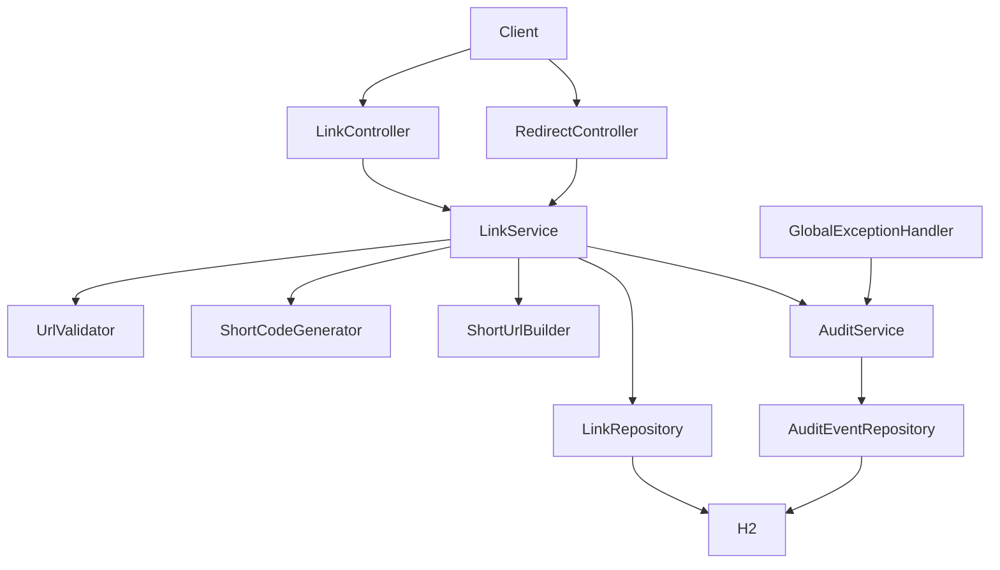
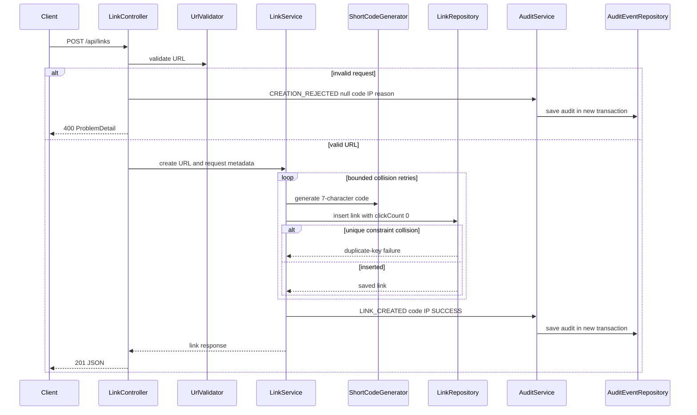
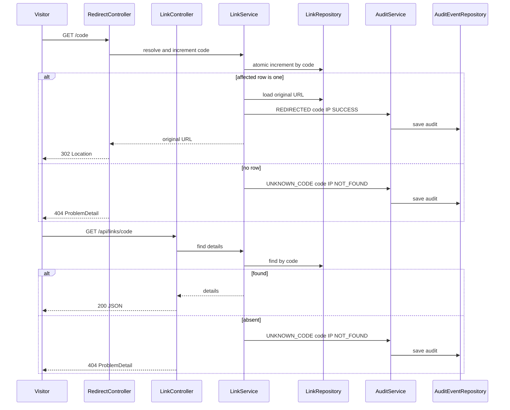
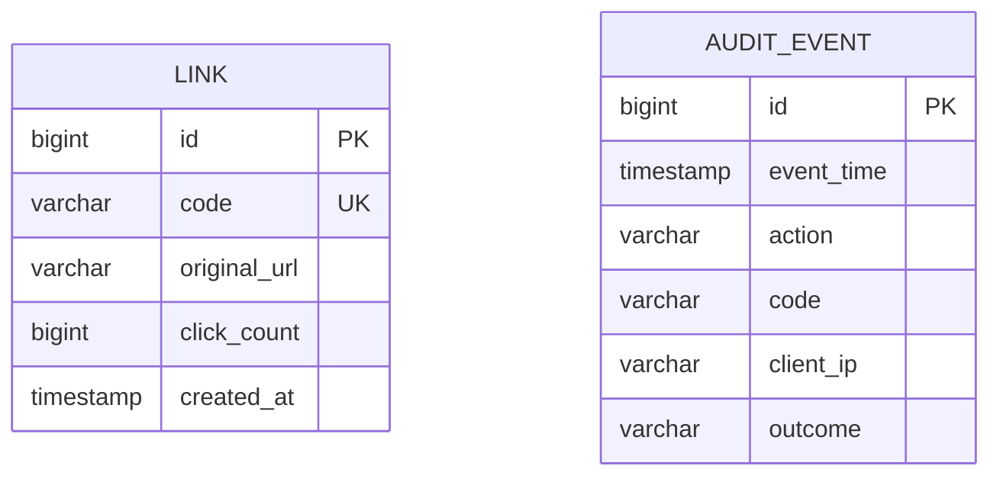

# URL Shortener Design

## Scope and compatibility

This is a greenfield implementation under `com.example.shortener`, using the existing Spring Boot application, H2 datasource, Spring Data JPA, Bean Validation, and Java 21. No external infrastructure or additional dependencies are required. The existing application class and H2 configuration remain compatible; `spring.jpa.hibernate.ddl-auto: update` creates the tables in the in-memory database.

Public operations are:

- `POST /api/links` creates an independently stored link for every valid submission.
- `GET /{code}` resolves a code, atomically increments its click count, records an audit event, and returns HTTP 302.
- `GET /api/links/{code}` returns link details and the current click count.

All request DTO validation uses `jakarta.validation`. Controllers use constructor injection and delegate to services. Errors are returned as RFC 7807 `ProblemDetail` responses without stack traces or sensitive values.

## Components and responsibilities

### Controllers

`LinkController` exposes creation and details endpoints. It obtains the remote IP from `HttpServletRequest` and passes it to the service. `RedirectController` exposes the root-level code route and returns a `ResponseEntity` with status `302 Found` and a `Location` header.

### Services

- `LinkService` owns creation, lookup, redirect resolution, click counting, and short URL construction orchestration.
- `UrlValidator` accepts only syntactically valid absolute URLs whose scheme is exactly `http` or `https` and which have a non-empty authority/host. It performs no network request.
- `ShortCodeGenerator` uses `SecureRandom` and a 62-character URL-safe alphabet (`A-Z`, `a-z`, `0-9`) to produce exactly seven characters.
- `ShortUrlBuilder` uses an optional configured `shortener.public-base-url`. If absent, it derives the base from the direct servlet request scheme, host, port, and context path. Forwarded headers are not trusted.
- `AuditService` persists required audit events in a separate transaction (`REQUIRES_NEW`) so an audit write is not rolled back with an unrelated link mutation. It also emits operational logs through SLF4J.

### Repositories

`LinkRepository` provides `findByCode`, `existsByCode`, and an atomic modifying query:

`update Link l set l.clickCount = l.clickCount + 1 where l.code = :code`

The update is executed inside a transaction and its affected-row count confirms that the link still exists. The `code` column has a unique constraint. `AuditEventRepository` is a standard `JpaRepository`.

## Request flows

### Link creation

Validation occurs before link persistence. Missing body, malformed JSON, missing URL, blank URL, and Bean Validation failures are routed through the exception handler, which creates a `CREATION_REJECTED` audit with a null code. A valid link is inserted before its successful creation audit is written. Collision retries emit no successful audit until insertion succeeds. A bounded retry limit prevents an infinite loop; exhaustion returns a generic 5xx response and is logged.

### Redirect and details lookup

The redirect transaction performs an atomic database increment rather than read-modify-write, so concurrent requests cannot lose increments. The original URL is read after successful resolution in the same transaction. A successful redirect produces exactly one `REDIRECTED` audit event. An unknown redirect produces exactly one `UNKNOWN_CODE` event. Details misses are also recorded as `UNKNOWN_CODE`, because they are handled unknown-code requests.

## Persisted data model

### `Link`

- `id`: generated `Long` primary key.
- `code`: non-null, unique, exactly seven characters, indexed through the unique constraint.
- `originalUrl`: non-null URL string, stored exactly as accepted after JSON parsing; use a column length sufficient for normal long URLs, such as 2048 characters.
- `clickCount`: non-null `long`, initialized to zero.
- `createdAt`: service-generated `Instant`.

### `AuditEvent`

- `id`: generated `Long` primary key.
- `eventTime`: non-null service-generated `Instant`.
- `action`: non-null vocabulary value: `LINK_CREATED`, `CREATION_REJECTED`, `REDIRECTED`, or `UNKNOWN_CODE`.
- `code`: nullable for rejected creations; populated for created, redirect, and unknown-code events when a code was supplied.
- `clientIp`: non-null remote address, with a safe bounded column length.
- `outcome`: non-null bounded text such as `SUCCESS`, `INVALID_URL:<reason>`, `REDIRECTED`, or `NOT_FOUND`.

JPA entities use `jakarta.persistence` annotations. Audit insertion failures are logged as errors. Required business responses are not replaced with an exception containing database details.

## URL validation algorithm

1. Reject null or blank input.
2. Parse with `java.net.URI`.
3. Require `isAbsolute()`.
4. Require scheme case-insensitively equal to `http` or `https`.
5. Require a non-empty authority and host; reject relative references and unsupported schemes.
6. Preserve the original submitted string for persistence and response.

Fragments, query strings, ports, and syntactically valid internationalized host representations accepted by the parser are not normalized or fetched. Validation errors use clear details such as `url must be an absolute HTTP or HTTPS URL`.

## Short-code generation and collision handling

`SecureRandom` selects seven characters from the 62-character alphabet. This produces URL-path-safe codes without sequential behavior. The database unique constraint is authoritative because a pre-check alone cannot prevent concurrent collisions.

Creation retries the complete insert after a duplicate-key exception, up to a small bounded maximum such as 10 attempts. Each attempt uses a newly generated code. A collision does not create an audit event or consume a successful code. If all attempts fail, the service logs an error and returns a generic 503 ProblemDetail; no link-created audit is emitted.

## Transactionality and reliability

- Link creation uses a transaction for the link insert. Its successful audit is written through `AuditService` in a separate transaction after persistence succeeds.
- Redirect resolution uses a transaction containing the atomic increment and URL read. The redirect audit is written after successful resolution through a separate transaction.
- Unknown-code audits use a separate transaction so the audit remains available even though the request returns 404.
- Audit writes are attempted exactly once for each handled operation. If an audit transaction fails, the failure is logged; the HTTP operation itself is not retried automatically, avoiding duplicate link mutations.
- The atomic update prevents lost increments under concurrent redirects. H2 transaction isolation and the database update operation provide serialization of competing row updates.
- H2 is in-memory with `DB_CLOSE_DELAY=-1`; data is intentionally not required to survive process restarts.
- Unexpected exceptions are handled centrally, logged with a correlation identifier where available, and mapped to a generic 500 ProblemDetail.

## Error handling

`GlobalExceptionHandler` handles:

- Bean Validation and missing-field errors: 400, clear validation detail, and `CREATION_REJECTED` for creation requests.
- Malformed JSON or unreadable request bodies: 400 and rejected-creation audit when the request targets creation.
- Invalid URL service exceptions: 400 and rejected-creation audit.
- Missing links: 404; redirect and details misses create `UNKNOWN_CODE` audits.
- Persistence conflicts after retry exhaustion: 503 or 500 as appropriate, with no database exception details exposed.
- Unexpected exceptions: 500 with generic detail and an error log.

Problem details use `application/problem+json` where supported and contain `type`, `title`, `status`, `detail`, and `instance`. They never include stack traces, credentials, full request bodies, or database internals.

## Logging and operational observability

Use SLF4J parameterized logs and the action vocabulary. Log only code, action, outcome, status, and a truncated or hashed request correlation value where useful; never log the full original URL, request body, credentials, secrets, or configuration values.

- `INFO`: successful `LINK_CREATED` with code and outcome; successful `REDIRECTED` with code and outcome.
- `WARN`: `CREATION_REJECTED` with a short validation reason; `UNKNOWN_CODE` with requested code and outcome.
- `ERROR`: unexpected exceptions, audit persistence failures, retry exhaustion, and infrastructure failures. Include exception type and correlation context, not sensitive payloads.

Client IP is persisted for audit requirements but is not written in full to normal operational logs. If logging IP is necessary for diagnosis, use a truncated or privacy-safe representation.

## Application audit trail

The following events are persisted:

| Action | When | Code | Outcome |
|---|---|---|---|
| `LINK_CREATED` | Link inserted successfully | Generated code | `SUCCESS` |
| `CREATION_REJECTED` | Creation request fails validation or binding | Null | `INVALID_URL:<safe reason>` or `INVALID_REQUEST:<safe reason>` |
| `REDIRECTED` | Known redirect resolved and incremented | Requested code | `REDIRECTED` |
| `UNKNOWN_CODE` | Redirect or details lookup misses | Requested code | `NOT_FOUND` |

Every event contains a service-generated timestamp, client IP, action, outcome, and nullable code. No full URL is stored in audit records.

## Testing requirements

Tests use JUnit 5, AssertJ, Mockito, and `@SpringBootTest` with `@AutoConfigureMockMvc` from `org.springframework.boot.webmvc.test.autoconfigure`. HTTP tests use MockMvc and repository assertions. They cover valid and duplicate creation, malformed/missing/unsupported URLs, code format and uniqueness, redirect status and location, details, unknown codes, audit action counts and fields, generic failures, and concurrent redirects. Concurrency tests issue multiple requests for one code and verify the persisted click count equals the number of successful redirects. No `@DataJpaTest`, `TestRestTemplate`, or `WebTestClient` is used.
